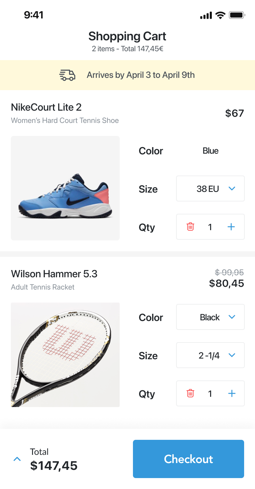
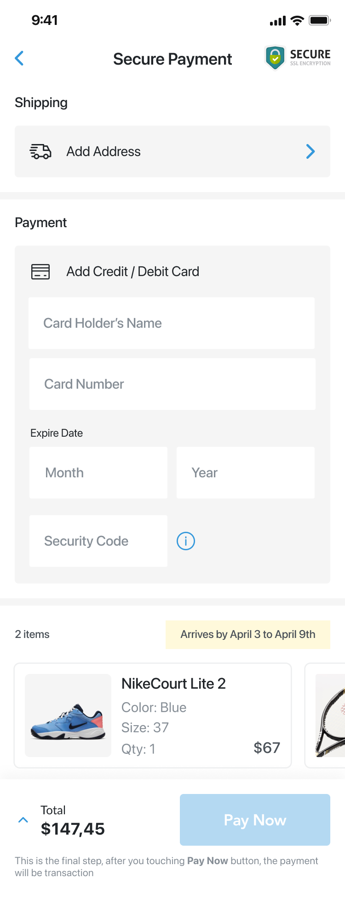
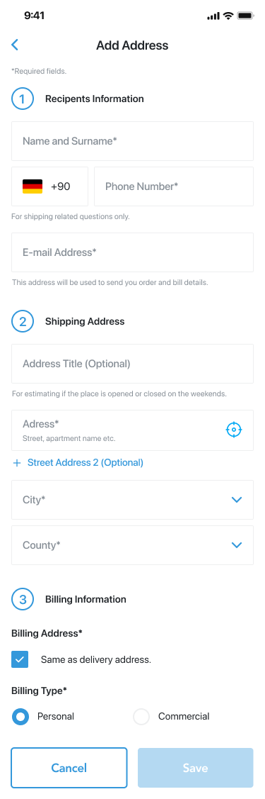
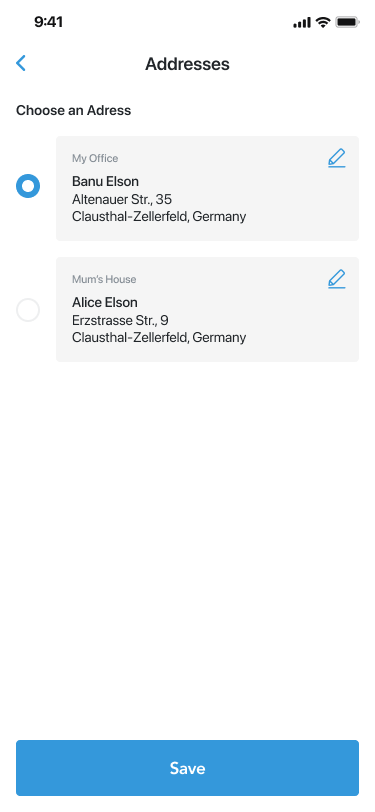
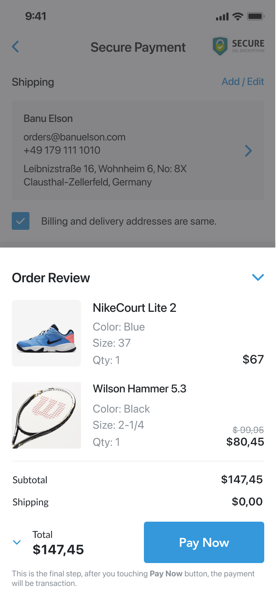
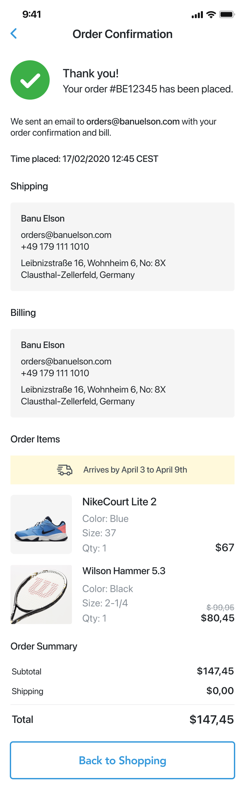

# 🛒 Checkout Flow - Mobile E-Commerce (React Native & Expo)

Aplicación móvil de flujo de compra (*Shopping Cart ➔ Secure Payment ➔ Addresses ➔ Confirmation*) desarrollada en **React Native** con **Expo (SDK 54)**, **Expo Router** y **TypeScript**, diseñada con fidelidad de píxel respecto a especificaciones de diseño en Figma y gestión de estado reactiva con **Zustand**.

---

## 📱 Vistas y Pantallas del Flujo

| 1. Shopping Cart | 2. Secure Payment | 3. Add Address |
| :---: | :---: | :---: |
|  |  |  |
| **4. Saved Addresses** | **5. Order Review Backdrop** | **6. Order Confirmation** |
|  |  |  |

---

## 🚀 Características Principales

### 1. Carrito de Compras (`/`)
- Listado interactivo de productos con imagen, título, precio base y precio tachado para descuentos.
- Modales selectores de variantes para **Color** y **Talle (Size)**.
- Control interactivo de cantidad (`Qty`) con incremento y botón de eliminación con icono de papelera cuando la cantidad es 1.
- Banner dinámico de fechas estimadas de entrega.
- Barra inferior fija con subtotal calculado en tiempo real y botón hacia Checkout.

### 2. Pago Seguro (`/checkout`)
- **Estado Vacío y Estado Completado**:
  - Si no hay dirección configurada, muestra el botón *"Add Address"* con icono de camión.
  - Al completar los datos, renderiza la tarjeta de dirección con opción *"Add / Edit"* y el checkbox *"Billing and delivery addresses are same."*.
  - Si no hay método de pago, muestra el formulario de tarjeta con inputs de titular, número (con formato automático cada 4 dígitos y logotipo de Mastercard), fecha de expiración (Month/Year) y código de seguridad (CVV) con icono informativo.
  - Al guardarse, colapsa en la tarjeta resumen *"My Virtual Debit Card"* mostrando viñetas y últimos 4 dígitos (`● ● ● 8553`).
- **Validación Reactiva**: El botón *"Pay Now"* se mantiene inactivo (`disabled`) en azul cielo suave (`#b2daf3`) si faltan campos obligatorios, y se activa en azul primario (`#3498db`) una vez completada la información.
- **Carrusel Horizontal**: Muestra los productos del carrito con imagen, especificaciones y precios.

### 3. Panel Desplegable "Order Review" (Bottom Sheet Backdrop)
- Al tocar el área de total o chevron en el pie de página de *Secure Payment*, se despliega un panel superpuesto con fondo oscurecido (`rgba(0, 0, 0, 0.4)`).
- Desglose detallado de productos, subtotales, costo de envío ($0,00) y botón para ejecutar el pago directamente desde el panel.
- Puede colapsarse tocando el chevron hacia abajo o el fondo oscurecido.

### 4. Gestión de Direcciones (`/address` y `/addresses`)
- **Formulario Add Address**: Campos estructurados para información del destinatario (con selector de prefijo de país 🇩🇪 `+49`), dirección con icono GPS interactivo, selector opcional de segunda línea de dirección, desplegables modales para *City* y *County*, y tipo de facturación (*Personal* / *Commercial*).
- **Lista de Direcciones Guardadas (Saved Addresses)**: Selección mediante radio buttons entre direcciones simuladas (*My Office* / *Mum's House*) y acceso a edición con icono de lápiz.

### 5. Confirmación de Compra (`/confirmation`)
- Encabezado con badge verde de confirmación y número de orden generado (`#BE12345`).
- Correo de notificación destacado en negrita y marca temporal de la transacción.
- Tarjetas de resumen para *Shipping* y *Billing*.
- Desglose financiero final y botón *"Back to Shopping"* que reinicia el carrito en Zustand y regresa al catálogo.

---

## 🛠️ Tecnologías y Librerías

- **Framework**: [React Native 0.81](https://reactnative.dev/) & [Expo SDK ~54](https://docs.expo.dev/)
- **Enrutamiento**: [Expo Router v6](https://docs.expo.dev/router/introduction/) (enfoque basado en archivos)
- **Lenguaje**: [TypeScript 5.9](https://www.typescriptlang.org/) (Strict Mode)
- **Estado Global**: [Zustand 5](https://zustand-demo.pmnd.rs/)
- **Iconos**: [@expo/vector-icons](https://icons.expo.fyi/) (Ionicons & MaterialCommunityIcons)
- **Safe Area**: [react-native-safe-area-context](https://github.com/th3rdwave/react-native-safe-area-context)
- **Linter & Formateo**: ESLint con `eslint-config-expo`

---

## 📐 Arquitectura de Archivos (Estructura Plana)

Siguiendo las directrices del proyecto, todos los componentes UI y de estado se mantienen en una estructura plana en la raíz para evitar anidamientos innecesarios, respetando las carpetas estrictamente requeridas por Expo Router:

```text
├── app/                              # Rutas de Expo Router (wrappers delgados)
│   ├── _layout.tsx                   # Stack Navigator principal
│   ├── index.tsx                     # Pantalla 1: Shopping Cart
│   ├── checkout.tsx                  # Pantalla 2: Secure Payment
│   ├── address.tsx                   # Pantalla 3: Add Address
│   ├── addresses.tsx                 # Pantalla 4: Saved Addresses
│   └── confirmation.tsx              # Pantalla 5: Order Confirmation
│
├── CartItem.tsx                      # Componente de tarjeta de producto en carrito
├── CheckoutScreen.tsx                # Pantalla principal de Secure Payment
├── AddAddressScreen.tsx              # Pantalla de formulario de nueva dirección
├── SavedAddressesScreen.tsx          # Pantalla de selección de direcciones guardadas
├── OrderReviewBackdrop.tsx           # Panel desplegable (bottom sheet) con backdrop
├── ConfirmationScreen.tsx            # Pantalla final de éxito de compra
├── AddressSummary.tsx                # Componente modular: Resumen de dirección guardada
├── PaymentMethodSummary.tsx          # Componente modular: Resumen de tarjeta colapsada
│
├── store.ts                          # Estado global centralizado con Zustand
├── theme.ts                          # Design Tokens (colores, tipografías, espaciados)
│
├── assets/                           # Recursos multimedia
│   ├── design/                       # Mockups de referencia de Figma
│   └── images/                       # Imágenes de productos e iconos
│
├── package.json
├── tsconfig.json
└── README.md
```

---

## ⚙️ Instalación y Ejecución

### Prerrequisitos
- Node.js (versión 18 o superior recomendada)
- npm o yarn
- Expo Go en tu dispositivo físico o un emulador/simulador (Android Studio / Xcode)

### 1. Clonar el repositorio e instalar dependencias
```bash
git clone <URL_DEL_REPOSITORIO>
cd checkout-tienda
npm install
```

### 2. Iniciar el servidor de desarrollo Expo
```bash
npx expo start
```

### 3. Ejecutar en plataformas específicas
- **Android**: Presiona `a` en la terminal o ejecuta `npm run android`
- **iOS**: Presiona `i` en la terminal o ejecuta `npm run ios`
- **Web**: Presiona `w` en la terminal o ejecuta `npm run web`

---

## 🧪 Calidad y Validación de Código

El proyecto cuenta con verificación estricta de tipos y estándares de código:

```bash
# Verificación de TypeScript sin emitir archivos
npx tsc --noEmit

# Análisis estático de código con ESLint
npm run lint
```
